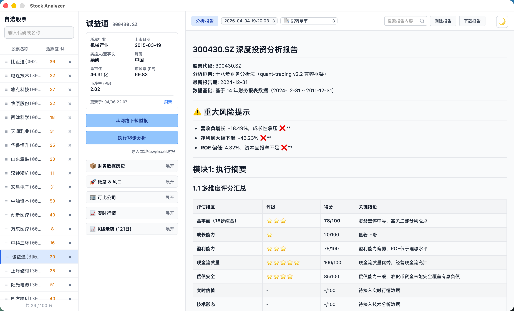

# Stock Analyzer

基于 **Wails v2 + Go + React + TypeScript** 的跨平台股票分析桌面应用，支持对 A 股及港股进行系统的「十八步财报分析法」评估，生成专业的深度投资分析报告。

---

## ✨ 功能特性

- **自选股票管理**：支持 A 股（沪/深/创业板/科创板/北交所）+ 港股，最多 100 只，拼音/代码/名称搜索，拖拽排序
- **财报数据获取**：
  - 从东方财富网络自动下载三大表
  - 支持同花顺 CSV/Excel 手动导入
  - 自动多源校验与历史版本归档（保留最近 3 批）
- **十八步财务分析引擎**：完整覆盖审计、资产质量、偿债、盈利、现金流、ROE、成长、分红等 18 个维度
- **Beneish M-Score**：完整模型计算财报操纵风险
- **可比公司分析**：添加 3~5 家可比公司，自动计算均值/最高/最低/排名百分位，支持多年度趋势对比
- **计算过程溯源**：核心财务指标支持逐层展开，查看原始数据、计算公式与中间步骤
- **实时行情**：对接东方财富 + 腾讯财经 fallback，展示最新价、PE/PB、换手率、K 线等
- **投资报告生成**：14 模块专业框架（执行摘要、基本面、横向对比、RIM 估值、技术面、ML 预测、智能选股、芒格逆向检查、巴芒清单、舆情监控、投资建议等），支持 Markdown 导出

---

## 📸 截图

### 深色模式


### 浅色模式


---

## 🛠️ 依赖要求

### 必需
- **Go** `>= 1.22`（推荐 1.26+）
- **Node.js** `>= 18`（推荐 20+）
- **npm** 或 **pnpm**
- **Wails CLI** `>= v2.12.0`

### macOS 额外依赖
- **Xcode Command Line Tools**：用于 CGO 编译
  ```bash
  xcode-select --install
  ```

### Windows 额外依赖
- **WebView2 Runtime**（Windows 10/11 通常已预装）
- **gcc 编译器**：推荐通过 [MSYS2](https://www.msys2.org/) 安装 `mingw-w64-x86_64-gcc`

### 安装 Wails CLI
```bash
go install github.com/wailsapp/wails/v2/cmd/wails@latest
```

验证安装：
```bash
wails version
```

---

## 🚀 构建与运行

### 1. 克隆项目
```bash
git clone https://github.com/yourusername/stock-analyzer.git
cd stock-analyzer
```

### 2. 安装前端依赖
```bash
cd frontend
npm install
cd ..
```

### 3. 开发模式
```bash
# 同时启动 Go 后端 + Vite 前端热重载
wails dev
```

开发模式下会自动打开桌面应用窗口。你也可以在浏览器中访问 `http://localhost:34115` 进行前端调试（Go 方法通过 Wails JS 绑定调用）。

### 4. 构建生产版本
```bash
# 构建当前平台的应用
wails build

# 构建 macOS Universal 二进制
wails build -platform darwin/universal

# 构建 Windows 可执行文件
wails build -platform windows/amd64
```

### 5. 打包分发（脚本）
```bash
# 同时构建 macOS + Windows 并生成 zip
./build-release.sh all

# 仅构建 macOS
./build-release.sh mac

# 仅构建 Windows
./build-release.sh windows
```

---

## 📁 项目结构

```
stock-analyzer/
├── app.go                    # Wails 主应用入口（暴露前后端绑定方法）
├── main.go                   # 程序入口
├── storage.go                # 本地文件存储（自选列表、财报数据、报告、缓存）
├── csvparser.go              # 同花顺 CSV/Excel 宽容解析器
├── build-release.sh          # 一键打包脚本
├── wails.json                # Wails 配置文件
├── go.mod                    # Go 模块依赖
├── analyzer/                 # 18 步财务分析引擎
│   ├── engine.go             # 分析主入口编排
│   ├── steps.go              # 18 步逐条计算逻辑
│   ├── data.go               # 财务数据结构与科目归一化
│   ├── types.go              # 分析结果类型定义（含 CalcTrace 溯源）
│   ├── mscore.go             # Beneish M-Score 模型
│   ├── evaluator.go          # 扣分规则与百分制评分
│   ├── report.go             # Markdown 报告生成
│   └── comparable.go         # 可比公司分析
├── downloader/               # 网络数据下载器
│   ├── eastmoney.go          # 东方财富 API（财报下载、行情、基本资料）
│   ├── mapping.go            # 科目映射表
│   ├── validator.go          # 多源数据校验
│   └── concept.go            # 概念与风口数据获取
├── frontend/                 # React + TypeScript + Vite 前端
│   ├── src/
│   │   ├── App.tsx           # 主应用组件
│   │   ├── App.css           # 主题样式（深色/浅色）
│   │   ├── KlineChart.tsx    # K 线图表组件
│   │   ├── stocks.ts         # 股票代码库
│   │   └── wailsjs/          # Wails 自动生成的 Go 绑定
│   ├── index.html
│   ├── package.json
│   └── vite.config.ts
├── docs/
│   └── screenshots/            # 项目截图
├── 功能列表.md               # 详细功能清单
└── README.md                 # 本文件
```

---

## 📝 数据说明

- **本地存储路径**：`~/.config/stock-analyzer/`
  - `watchlist.json`：自选列表
  - `comparables.json`：可比公司配置
  - `data/{symbol}/`：当前生效的财报 JSON
  - `data/{symbol}/history/`：历史归档（最近 3 批）
  - `reports/{symbol}/`：生成的 Markdown 报告

- **数据来源**：东方财富公开 API、腾讯财经接口、用户手动导入 CSV

---

## 🗺️ 改进计划（Roadmap）

### A-Score：A 股适配综合风险评分（进行中）

**问题**：当前使用的 Beneish M-Score 是基于美国上市公司（1990s）样本训练的财务造假识别模型。在 A 股市场存在两个明显缺陷：
1. **误杀率高**：A 股很多公司的应收账款结构、折旧政策、费用资本化规则与美国不同，容易将正常公司误判为“造假嫌疑”。
2. **漏检率高**：A 股典型舞弊手段（股权质押套现、关联交易输血、大股东资金占用、虚构现金流）M-Score 完全无法捕捉。

**方案**：不抛弃 M-Score，而是将其降级为子模块之一，融合成一个更适合 A 股的综合风险评分 **A-Score（0-100 分，100 分=最危险）**。

#### A-Score 三层次构成

| 层次 | 指标 | 权重 | 数据来源 | 说明 |
|------|------|------|----------|------|
| **财务造假层** | M-Score | 15% | 现有财报 | 保留但权重降低 |
| | 现金流偏离度 | 20% | 现有财报 | 净利润现金含量 + 营收现金含量 |
| | 应收账款异常度 | 15% | 现有财报 | DSRI 独立监控 |
| | 毛利率异常波动 | 10% | 现有财报 | GMI 连续两年恶化 |
| **破产/偿债层** | Z-Score | 20% | 现有财报 | Altman Z-Score 破产风险（A股适配版） |
| **A股特有层** | 股权质押率 | 10% | 爬虫获取 | 大股东高质押 = 高风险 |
| | 监管问询/减持 | 10% | 爬虫获取 | 收到交易所问询函、大股东减持 |

#### 实施阶段

- **第一阶段（纯财报可计算）**：
  - 将 `step8MScore` 扩展为 `step8RiskAnalysis`，基于现有三大表计算 Z-Score、现金流偏离度、应收账款异常度、毛利率异常波动，输出综合 A-Score。
  - 修改 `evaluator.go` 和 `report.go`，把原本对 M-Score 的“一票否决”硬阈值，替换为 A-Score 的分层阈值（≥70 红灯、50-70 黄灯、<50 绿灯）。
  - 更新 ML Engine B 的输入特征，用 A-Score 子特征替代单一的 `mscore_proxy`。

- **第二阶段（接入非财务爬虫）**：
  - 通过 Python（akshare / 东方财富）抓取股权质押比例、大股东减持、交易所问询函次数，纳入 A-Score 计算。

- **第三阶段（训练 Engine D）**：
  - 以历史 A 股舞弊/退市公司为正样本，训练 LightGBM 风险预警模型（Engine D），输入为 A-Score 各维度 + 技术面 + 活跃度。

---

## 📄 License

[MIT](./LICENSE)
