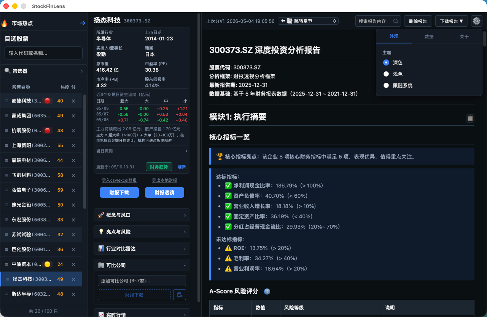
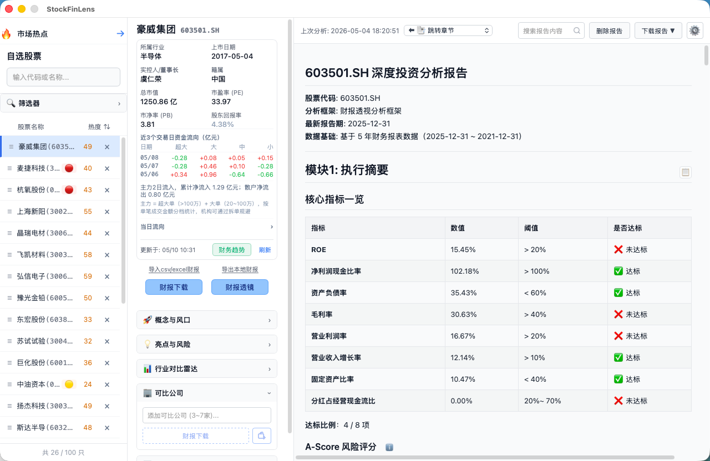
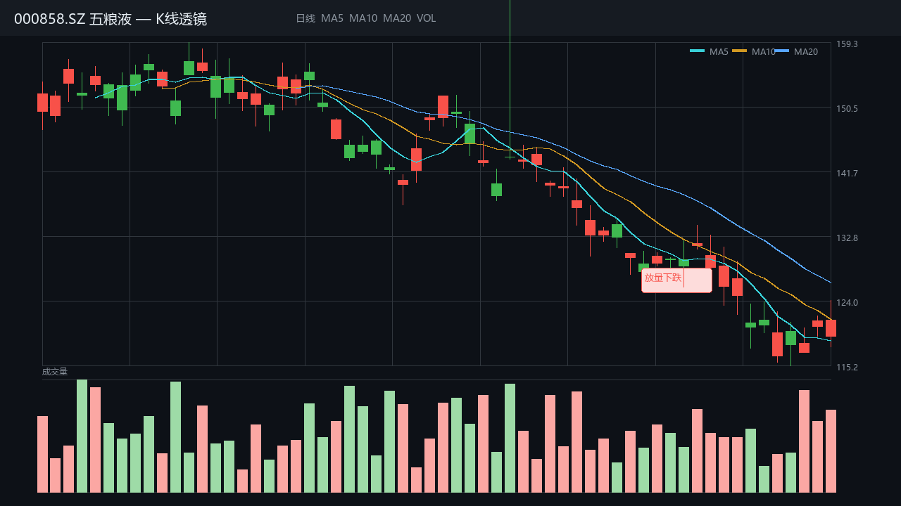
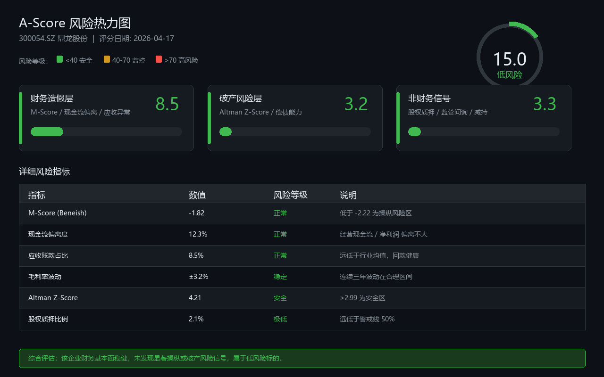

<div align="center">


# 股票财报透镜 StockFinLens

**基于 Wails + Go + React 的跨平台股票财报透视工具**

[](https://opensource.org/licenses/MIT)
[](https://golang.org)
[](https://github.com/liusaipu/stockfinlens/stargazers)

[English](./README_EN.md) | 简体中文



</div>

---

## 🔍 这是什么？

一款专为 **A股/港股** 投资者设计的开源财报透视工具。

就像光学透镜能放大肉眼看不见的细微结构，**股票财报透镜** 帮你穿透冗长的财务报表，看清企业真实的经营状况、潜在风险和内在价值。

> ⚠️ **免责声明**：本工具仅供学习研究使用，不构成投资建议。股市有风险，投资需谨慎。

---

## ✨ 核心透视能力

### 🔬 财报透视分析

从审计意见到分红政策，逐层拆解企业财务健康度：

| 透视维度     | 看清什么                 |
| -------- | -------------------- |
| **审计层**  | 审计意见类型、非标事项、会计政策变更   |
| **资产质量** | 应收账款账龄、存货周转、商誉减值风险   |
| **偿债能力** | 流动/速动比率、资产负债率、利息保障倍数 |
| **盈利透视** | 毛利率趋势、净利率稳定性、ROE杜邦分解 |
| **现金流**  | 经营现金流质量、自由现金流、现金含量   |
| **成长性**  | 营收增长可持续性、利润增长质量      |

### ⚠️ A-Score 风险热力图（A股特供）

专为A股设计的6维风险评分，0-100分量化企业"健康度"：

```
A-Score = 财务造假层(60%) + 破产风险层(20%) + 非财务信号层(20%)
        = M-Score + 现金流偏离 + 应收异常 + 毛利率波动
        + Altman Z-Score + 股权质押/监管问询/减持信号
```

- 🔴 **>70分**：高风险，建议远离
- 🟡 **40-70分**：中等风险，需持续监控  
- 🟢 **<40分**：低风险，相对健康

### 🎯 可比公司聚焦分析

添加3-5家同行业公司，自动生成：

- 行业均值/最高/最低对比
- 排名百分位可视化
- 多年度趋势追踪
- 7维度加权评分排序（ROE 25%、毛利率 20%、A-Score 10%等）

### 🔍 计算溯源放大镜

点击任意指标，逐层展开：

- 原始数据来源（哪张表、哪个科目）
- 计算公式（支持标准财务公式）
- 中间计算步骤（拒绝黑箱）

### 🤖 ML 智能预测

本地 ONNX 双引擎推理，无需联网：

- **情绪引擎**：财报文本情绪分析
- **财务引擎**：基于历史数据的趋势预测
- **风险引擎**：LightGBM 事前风险预警

---

## 🚀 5分钟快速体验

### 下载即用

从 [Releases](https://github.com/liusaipu/stockfinlens/releases) 下载对应平台安装包：

| 平台      | 文件                           | 系统要求          |
| ------- | ---------------------------- | ------------- |
| macOS   | `stockfinlens-darwin-*.zip`  | macOS 11+     |
| Windows | `stockfinlens-windows-*.zip` | Windows 10/11 |

### 运行前准备

```bash
# 安装 Python 依赖（必需）
pip install onnxruntime scikit-learn numpy

# （可选）安装 akshare 获取完整功能
pip install akshare
```

> **⚠️ Windows 用户注意**
>
> 请使用 [python.org](https://www.python.org/downloads/) 官方安装包，**不推荐**使用 Microsoft Store 版本的 Python。
>
> Windows Store 版 Python 是一个 redirector/shim，在通过本应用自动安装依赖时可能出现 `exit status 9009` 错误（找不到 pip 模块），导致 ML 预测等 Python 相关功能无法使用。如已安装 Windows Store 版，建议卸载后从 python.org 重新安装（安装时勾选 "Add Python to PATH"）。
>

### 启动与使用

1. 添加自选股（支持拼音首字母搜索，如输入"mt"匹配"茅台"）
2. 下载财报数据（自动从多数据源交叉验证获取）
3. 点击「财报透镜」，生成深度透视报告
4. 查看右栏报告，使用搜索框快速定位关注指标

---

## 📸 界面预览

| 深色模式 - 主界面                              | 浅色模式 - 报告阅读                                 |
|:---------------------------------------:|:-------------------------------------------:|
|  |  |

| K线图表                                 | A-Score 风险画像                           |
|:------------------------------------:|:--------------------------------------:|
|  |  |

---

## 🛠️ 从源码构建

### 依赖要求

- Go >= 1.22
- Node.js >= 18  
- Python 3.10+
- Wails CLI >= v2.12

```bash
# 安装 Wails
go install github.com/wailsapp/wails/v2/cmd/wails@latest

# 克隆项目
git clone https://github.com/liusaipu/stockfinlens.git
cd stockfinlens

# 安装前端依赖
cd frontend && npm install && cd ..

# 开发模式（热重载）
wails dev

# 构建生产版本
wails build
```

详细构建指南见 [BUILD.md](./docs/BUILD.md)

---

## 📊 技术架构

| 层级 | 技术栈 | 核心能力 |
|------|--------|----------|
| **前端层** | React + TypeScript + Vite | K线透镜 · 财报展示 · 报告渲染 · 交互设置面板 |
| **Wails 绑定层** | Go + Wails v2 | 本地存储 · 数据校验 · 分析编排 · 报告生成 |
| **透视引擎** | Go | 财报透视分析 · A-Score 评分 · RIM 估值 · 可比公司聚焦 |
| **ML 推理层** | Python + ONNX Runtime | 情绪引擎 · 财务引擎 · 风险引擎（纯本地推理，无需联网） |
| **数据源** | 多源聚合 | 公开数据源交叉验证 · CSV/Excel 导入 · 可选付费数据源增强 |

---

## 📝 数据说明

**本地存储路径**：`~/.config/stock-analyzer/`

- `watchlist.json`：自选股票列表（最多100只）
- `comparables.json`：可比公司配置
- `data/{symbol}/`：当前生效的财报 JSON
- `data/{symbol}/history/`：历史归档（保留最近3批，支持回溯）
- `reports/{symbol}/`：生成的 Markdown 分析报告

### 多数据源交叉验证

财报数据通过**多数据源聚合与交叉验证**获取，自动比对不同渠道的财务报表，当单一数据源字段缺失或存在偏差时，系统会尝试从备用源补充或校正，确保原始数据的完整性与可靠性。

### StockFinLens 数据源（可选增强）

部分深度数据由开发者通过**付费数据接口**获取并维护。如果用户遇到极少数股票数据获取不到或字段缺失的情况，可以在应用内「**设置 → 数据 → StockFinLens 数据源**」中开启授权，或联系开发者协助增加该股票的数据源支持。

---

## 🗺️ 路线图

- [x] 财报透视引擎
- [x] A-Score 风险热力图
- [x] ML 三引擎本地推理 (ONNX)
- [x] 可比公司聚焦分析
- [x] 计算溯源放大镜 (CalcTrace)
- [x] 实时行情与K线图表
- [x] 市场热点板块与快速分析
- [x] Python 依赖自动检测
- [x] 数据源自动切换与质量修复
- [ ] 智能财报问答 (LLM)
- [ ] iOS 移动端 (SwiftUI)

---

## 🤝 参与贡献

欢迎 Issue 和 PR！请阅读 [CONTRIBUTING.md](./CONTRIBUTING.md) 了解如何参与。

特别感谢：

- [Wails](https://wails.io/) — 跨平台桌面框架
- [Apache ECharts](https://echarts.apache.org/) — K线图表渲染
- [akshare](https://akshare.xyz/) — A股数据接口

---

## 📄 License

[MIT License](./LICENSE) © 2026 liusaipu

---

<div align="center">

如果 **股票财报透镜** 帮你看清了财报背后的真相，请 ⭐ **Star** 支持一下！

[报告 Bug](https://github.com/liusaipu/stockfinlens/issues) · [功能建议](https://github.com/liusaipu/stockfinlens/issues) · [下载最新版](https://github.com/liusaipu/stockfinlens/releases)

</div>
